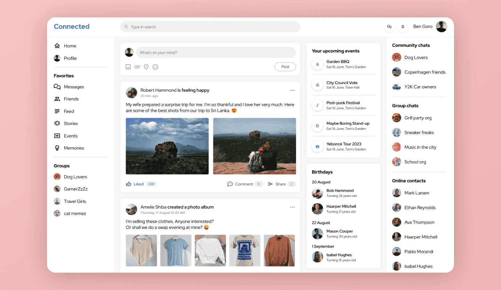

# 🚀 Social App

A modern social networking web application built with **React & Vite** — allowing users to interact with posts and connect with others.

Live Demo: https://social-app-phi-ruby.vercel.app/

---

## 📌 Overview

**Social App** is a frontend React project built using Vite.  
It showcases a clean UI, interactive user feed, and responsive design — great as a portfolio project to demonstrate your React skills and front-end development capabilities.

---

## 🛠️ Tech Stack

- **Frontend:** React  
- **Bundler:** Vite  
- **Languages:** JavaScript, HTML, CSS  
- **Styling:** CSS Modules / Tailwind (if used)  
- **Deployment:** Vercel

---

## ✨ Features

✔ Fast, responsive UI  
✔ Dynamic feed layout  
✔ Smooth transitions & animations  
✔ Deployed live on Vercel  
✔ Ready to integrate backend APIs

---

## 📸 Screenshots

<center>
  
</center>

*(Add more screenshots showing different parts of the app — mobile view, feed, etc.)*

---

## 🧑‍💻 How to Run Locally

1. **Clone the repo**
   ```bash
   git clone https://github.com/ranjan986/social-app.git
